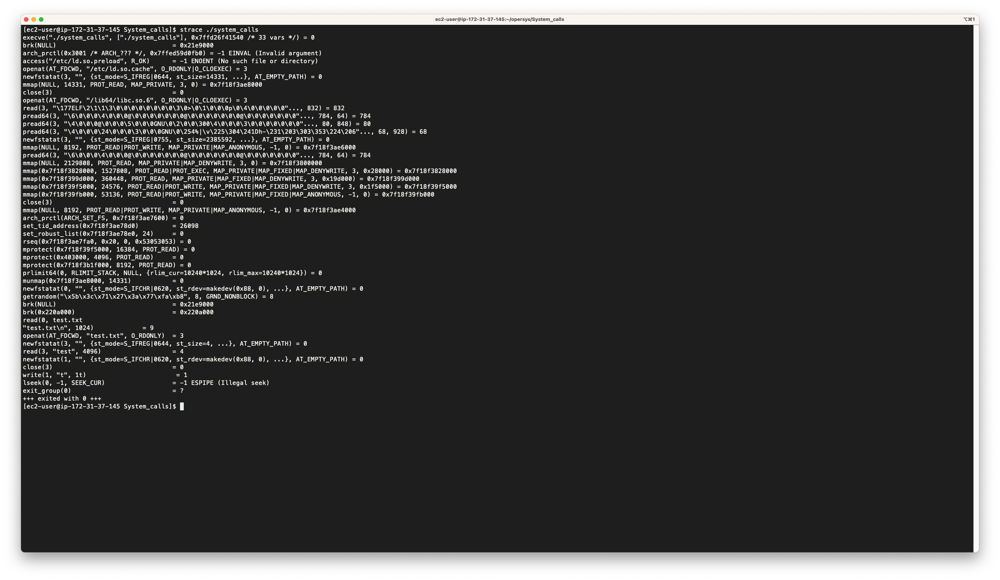

# System Calls

1. source code ต่อไปนี้ต้องการเปิด file ตามที่ user กำหนด จากนั้น อ่าน 100 byte แรกของไฟล์ แล้วพิมพ์ byte แรกของไฟล์ออกทาง standard output ให้เติม source code ภาษา C ต่อไปนี้ให้สมบูรณ์โดยใช้ system call จาก posix library (open, read, write)
2. ทดลอง run ใน linux (จะใช้ Cloud9 หรือ WSL หรือ virtual machine ก็ได้) โดยใช้ strace
3. list system calls ทั้งหมดที่พบจากการ run strace ตามลำดับการเรียกใช้ เช่น execve, brk



```console
[ec2-user@ip-172-31-37-145 System_calls]$ strace ./system_calls
execve("./system_calls", ["./system_calls"], 0x7ffd26f41540 /* 33 vars */) = 0
brk(NULL)                               = 0x21e9000
arch_prctl(0x3001 /* ARCH_??? */, 0x7ffed59d0fb0) = -1 EINVAL (Invalid argument)
access("/etc/ld.so.preload", R_OK)      = -1 ENOENT (No such file or directory)
openat(AT_FDCWD, "/etc/ld.so.cache", O_RDONLY|O_CLOEXEC) = 3
newfstatat(3, "", {st_mode=S_IFREG|0644, st_size=14331, ...}, AT_EMPTY_PATH) = 0
mmap(NULL, 14331, PROT_READ, MAP_PRIVATE, 3, 0) = 0x7f18f3ae8000
close(3)                                = 0
openat(AT_FDCWD, "/lib64/libc.so.6", O_RDONLY|O_CLOEXEC) = 3
read(3, "\177ELF\2\1\1\3\0\0\0\0\0\0\0\0\3\0>\0\1\0\0\0p\0\4\0\0\0\0\0"..., 832) = 832
pread64(3, "\6\0\0\0\4\0\0\0@\0\0\0\0\0\0\0@\0\0\0\0\0\0\0@\0\0\0\0\0\0\0"..., 784, 64) = 784
pread64(3, "\4\0\0\0@\0\0\0\5\0\0\0GNU\0\2\0\0\300\4\0\0\0\3\0\0\0\0\0\0\0"..., 80, 848) = 80
pread64(3, "\4\0\0\0\24\0\0\0\3\0\0\0GNU\0\254%|\v\225\304\241Dh-\231\203\303\353\224\206"..., 68, 928) = 68
newfstatat(3, "", {st_mode=S_IFREG|0755, st_size=2385592, ...}, AT_EMPTY_PATH) = 0
mmap(NULL, 8192, PROT_READ|PROT_WRITE, MAP_PRIVATE|MAP_ANONYMOUS, -1, 0) = 0x7f18f3ae6000
pread64(3, "\6\0\0\0\4\0\0\0@\0\0\0\0\0\0\0@\0\0\0\0\0\0\0@\0\0\0\0\0\0\0"..., 784, 64) = 784
mmap(NULL, 2129808, PROT_READ, MAP_PRIVATE|MAP_DENYWRITE, 3, 0) = 0x7f18f3800000
mmap(0x7f18f3828000, 1527808, PROT_READ|PROT_EXEC, MAP_PRIVATE|MAP_FIXED|MAP_DENYWRITE, 3, 0x28000) = 0x7f18f3828000
mmap(0x7f18f399d000, 360448, PROT_READ, MAP_PRIVATE|MAP_FIXED|MAP_DENYWRITE, 3, 0x19d000) = 0x7f18f399d000
mmap(0x7f18f39f5000, 24576, PROT_READ|PROT_WRITE, MAP_PRIVATE|MAP_FIXED|MAP_DENYWRITE, 3, 0x1f5000) = 0x7f18f39f5000
mmap(0x7f18f39fb000, 53136, PROT_READ|PROT_WRITE, MAP_PRIVATE|MAP_FIXED|MAP_ANONYMOUS, -1, 0) = 0x7f18f39fb000
close(3)                                = 0
mmap(NULL, 8192, PROT_READ|PROT_WRITE, MAP_PRIVATE|MAP_ANONYMOUS, -1, 0) = 0x7f18f3ae4000
arch_prctl(ARCH_SET_FS, 0x7f18f3ae7600) = 0
set_tid_address(0x7f18f3ae78d0)         = 26098
set_robust_list(0x7f18f3ae78e0, 24)     = 0
rseq(0x7f18f3ae7fa0, 0x20, 0, 0x53053053) = 0
mprotect(0x7f18f39f5000, 16384, PROT_READ) = 0
mprotect(0x403000, 4096, PROT_READ)     = 0
mprotect(0x7f18f3b1f000, 8192, PROT_READ) = 0
prlimit64(0, RLIMIT_STACK, NULL, {rlim_cur=10240*1024, rlim_max=10240*1024}) = 0
munmap(0x7f18f3ae8000, 14331)           = 0
newfstatat(0, "", {st_mode=S_IFCHR|0620, st_rdev=makedev(0x88, 0), ...}, AT_EMPTY_PATH) = 0
getrandom("\x5b\x3c\x71\x27\x3a\x77\xfa\xb8", 8, GRND_NONBLOCK) = 8
brk(NULL)                               = 0x21e9000
brk(0x220a000)                          = 0x220a000
read(0, test.txt
"test.txt\n", 1024)             = 9
openat(AT_FDCWD, "test.txt", O_RDONLY)  = 3
newfstatat(3, "", {st_mode=S_IFREG|0644, st_size=4, ...}, AT_EMPTY_PATH) = 0
read(3, "test", 4096)                   = 4
newfstatat(1, "", {st_mode=S_IFCHR|0620, st_rdev=makedev(0x88, 0), ...}, AT_EMPTY_PATH) = 0
close(3)                                = 0
write(1, "t", 1t)                        = 1
lseek(0, -1, SEEK_CUR)                  = -1 ESPIPE (Illegal seek)
exit_group(0)                           = ?
+++ exited with 0 +++
```